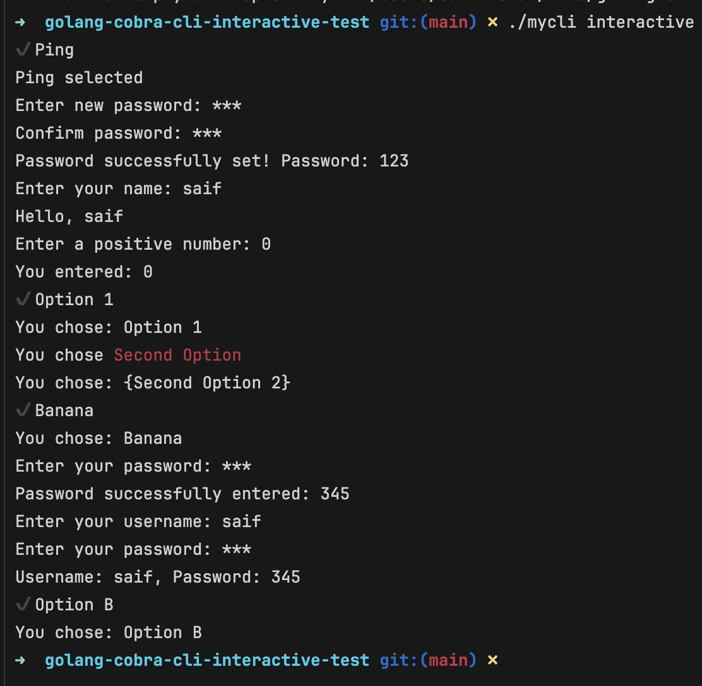
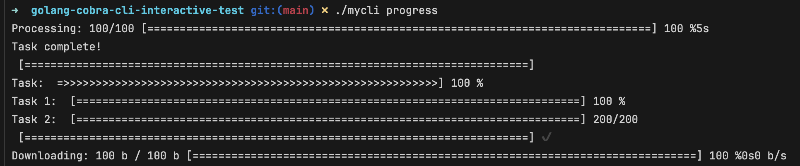

# MyCLI

MyCLI is an interactive command-line tool for network diagnostics and demonstrations. It provides utility commands for tasks like pinging, traceroute, and interactive prompts, along with a progress bar demonstration for task tracking.

## Features

- **Ping:** Send ICMP echo requests to check the availability of a host.
- **Traceroute:** Trace the route packets take to a specified host.
- **Interactive Mode:** Use interactive prompts to navigate through options.
- **Progress Bar:** Visualize progress for tasks with a terminal progress bar.

## Prerequisites

Ensure you have the following installed:

- [Go](https://golang.org/) (version 1.16 or higher)
- `github.com/spf13/cobra`
- `github.com/manifoldco/promptui`
- `github.com/vbauerster/mpb`

## Installation

1. Clone the repository:
   ```bash
   git clone <repository-url>
   cd <repository-folder>
   ```

2. Install dependencies:
   ```bash
   go mod tidy
   ```

3. Build the project:
   ```bash
   go build -o mycli
   ```

4. Run the tool:
   ```bash
   ./mycli
   ```

## Usage

### Commands

- **Ping a Host:**
  ```bash
  ./mycli ping [host] -c [count]
  ```
  Example:
  ```bash
  ./mycli ping example.com -c 5
  ```

- **Trace a Route:**
  ```bash
  ./mycli traceroute [host]
  ```
  Example:
  ```bash
  ./mycli traceroute example.com
  ```

- **Start Interactive Mode:**
  ```bash
  ./mycli interactive
  ```

- **Progress Bar Demonstration:**
  ```bash
  ./mycli progress
  ```

### Interactive Features
The interactive mode allows users to:
- Select tools like Ping or Traceroute.
- Input and validate custom data.
- Choose items from a menu using `promptui`.

### Progress Bar
Visualize task completion using a customizable progress bar implemented with `mpb`.

## Example Demo

### Interactive Session



### Progress Bar


## Contributing

Feel free to submit issues or pull requests for improvements or bug fixes. Contributions are welcome!

## License

This project is licensed under the MIT License.
